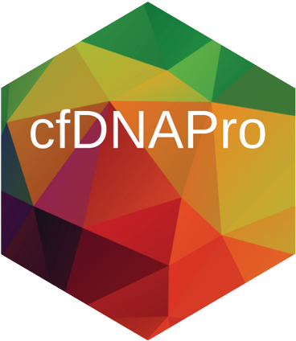
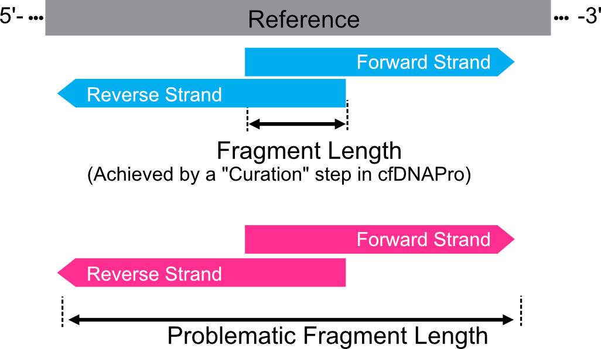

|

Introduction
============

``cfDNAPro`` is an R/Bioconductor package designed for the
extraction and visualization of cell-free DNA (cfDNA) features.
It provides a user-friendly framework for the automated characterization
and visualization of cfDNA sequencing data. The cfDNAPro package includes
functions for calculating overall, median, and modal fragment size
distributions, as well as identifying peaks, troughs, and the periodicity
of oscillations in the fragment size profile. Additionally, it features robust
data visualization tools.

The package can also process Copy-Number (CN) and
single point mutation information from cfDNA fragment data.
This functionality enables the integration of multiple features,
such as fragment size and mutation status, allowing for comprehensive
analysis and plotting of the data,
`as demonstrated in our publication in X Journal <X>`__.
The ``cfDNAPro`` package has been accepted by Bioconductor: `cfDNAPro.html <https://bioconductor.org/packages/release/bioc/html/cfDNAPro.html>`__.

Motivation
**********

Cell-free DNA (cfDNA) enters human blood circulation by various
biological processes, and includes tumour-derived circulating
tumour DNA (ctDNA). There is increasing evidence that differences 
in biological features between cfDNA and ctDNA could be exploited
to improve cancer detection, treatment selection and minimal residual
disease detection. However, there are currently no R packages that
support analysis of cfDNA biological features such as fragment length,
nucleotide frequency, nucleosome occupancy etc.

Uses and Applications
*********************

``cfDNAPro`` can be used for a variety of cfDNA-related analysis tasks:

- Cancer early detection, monitoring and therapy personalisation
- Exploration of curated cfDNA biological features
- Comprehensive cfDNA fragment annotation for Machine Learning Model Building
- cfDNA mutation list refinement

Highlights
**********

``cfDNAPro`` addresses the problem regarding reproducibility
of cfDNA fragment data analysis.

The definition of "fragment length" varies across different alignment software,
leading to concerns (see page 9 footnote in the SAM file format specification document
`SAMv1.pdf <https://samtools.github.io/hts-specs/SAMv1.pdf>`__).
The need for single-molecule level resolution in cell-free DNA
fragmentomic analyses underscores the critical importance of precise
and unbiased feature extraction.

cfDNAPro is designed to resolve this issue and standardize the
cfDNA fragmentomic analysis.

As an example, we showcase how an ambiguous case occurs when there are
sequence-through issues.

Here, we propose that the cfDNA fragment is the
region between the left boundary of the forward strand and the right
boundary of the reverse strand.

Input Files
***********

Within ``cfDNAPro``, the primary input consists of
one or more BAM files from paired-end whole-genome sequencing
(WGS) with variable depths. While the package also supports other
paired-end sequencing methods like targeted sequencing, it has not
been evaluated with these protocols.

.. code:: R

    library(cfDNAPro)
    # read bam file, do alignment curation
    frags <- readBam(bamfile = "/path/to/bamfile.bam")
    # convert GRanges object to a dataframe in R
    frag_df <- as.data.frame(frags)

Alternatively, ``cfDNAPro`` can read in insert sizes metrics files
produced by Picard Tools, using the `CollectInsertSizeMetrics`
tool, for fragment size analysis.
To use cfDNAPro package, gathering all txt files generated by Picard or
bam files into sub-folders named by cohort name is required,
even if when you have only one cohort. Example txt files are installed
together with this package.

Currently cfDNAPro is compatible exclusively with insert sizes metrics files
produced by Picard Tools, using the `CollectInsertSizeMetrics` tool, which can
be accessed `here
<http://broadinstitute.github.io/picard/command-line-overview.html#CollectInsertSizeMetrics>`__.

.. code:: R

    library(cfDNAPro)
    path <- "path/to/main/folder"
    myplot <- callMode(path = path) %>% plotMode()

If users want to access mutational fragment information,
they should supply a .tsv file containing a mutation list
with four columns (chr, pos, ref, alt). This will enable the
annotation of each fragment's status based on the overlap of
the paired-end reads and the base of the fragment.

.. code:: R

    library(cfDNAPro)
    # read bam file, do alignment curation
    frags <- readBam(bamfile = "/path/to/bamfile.bam", mutation_file = "/path/to/mutations.tsv")
    # convert GRanges object to a dataframe in R
    frag_df <- as.data.frame(frags)

Package Usage Guide
********************

The ``cfDNAPro`` offers a range of applications, all of which are detailed in the :ref:`tutorial section <cfdnapro_usage_tutorials>`. Also
check out the convenient :ref:`summary tool <cfDNAPro_summary_tool>` if you are analyzing multiple samples or
region-sets.

More details on the R function parameters can be ound :ref:`here <cfdnapro_functions>`

Contact
*******
If you have any questions about ``cfDNAPro``, you can create an issue on `github <https://github.com/hw538/cfDNAPro>`_ or contact haichao.wang@cruk.cam.ac.uk, paulius.mennea@cruk.cam.ac.uk.

Source code on Github
*********************
The github repository of ``cfDNAPro`` can be found at `https://github.com/hw538/cfDNAPro <https://github.com/hw538/cfDNAPro>`_.

.. _installation_anchor:

Installation
============

Install directly in R
*********************
``cfDNAPro`` can be installed directly in R:

.. code:: R

    if (!require(devtools)) install.packages("devtools")
    library(devtools)
    devtools::install_github("hw538/cfDNAPro", build_vignettes = TRUE)

Install via conda or mamba
**************************

``cfDNAPro`` can also be installed via `conda <https://docs.conda.io/en/latest/>`_ (or `mamba <https://mamba.readthedocs.io/en/latest/>`_ , a faster alternative to conda).

.. code-block:: bash

    # to install on Linux and macOS
    conda create -n cfDNAPro -c bioconda -c conda-forge cfDNAPro

    # to activate the environment
    conda activate cfDNAPro # or: 'mamba activate cfDNAPro'

Citation
========

If you use ``cfDNAPro`` in any published work, please cite:

`Haichao Wang, Paulius D. Mennea et al (2020). cfDNAPro: An R/Bioconductor package to extract and visualise cell-free DNA biological features. R package version 1.7 https://github.com/hw538/cfDNAPro`
