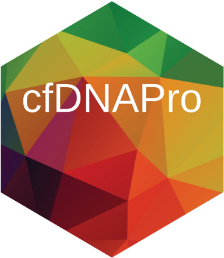

.. cfDNAPro documentation master file, created by
   sphinx-quickstart on Wed Aug  5 17:28:19 2020.
   You can adapt this file completely to your liking, but it should at least
   contain the root `toctree` directive.

|

cfDNAPro: Liquid Biopsy Cell-Free DNA Fragment Analyser
==========================================================================

Welcome to the documentation for ``cfDNAPro``. Use the menu on the left to 
explore more about the tool. Below is a brief overview:

Brief Introduction
********************

``cfDNAPro`` is a bioinformatics R package designed for the curation and analysis
of cfDNA fragment features, which play a crucial role in the early detection of
cancer and ongoing disease monitoring. This package facilitates the extraction
of key biological features from cfDNA Next-Generation Sequencing (NGS) data,
including fragment size, fragment end motif, copy number (CN), and mutations.
Analyzing and visualizing these features typically involves using multiple tools,
which can be time-consuming.

To streamline this process, cfDNAPro provides two primary sets of functions: one for
data characterization and another for data visualization.

A Quick Example
********************

``cfDNAPro`` can be installed in R by following these instructions (:ref:`additional details <installation_anchor>`):

.. code:: R

  if (!require(devtools)) install.packages("devtools")
  library(devtools)
  devtools::install_github("hw538/cfDNAPro", build_vignettes = TRUE)

To visualise the fragment size mode of each sample,
``cfDNAPro`` can read pre-existing insert size metrics
files from multiple cohort sub-folders stored in
*path/to/main/folder*:

.. code:: R

  library(cfDNAPro)
  path <- "path/to/main/folder"
  myplot <- callMode(path = path) %>% plotMode()

Currently cfDNAPro is compatible exclusively with insert sizes metrics files
produced by Picard Tools, using the `CollectInsertSizeMetrics` tool, which can
be accessed `here 
<http://broadinstitute.github.io/picard/command-line-overview.html#CollectInsertSizeMetrics>`__. 
Future versions will include additional features.

R Package Vignettes
********************

To access the vignettes in RStudio (you have to indicate
``build_vignettes = TRUE`` during the aforementioned installation step), use
the command:

.. code:: R

  browseVignettes("cfDNAPro")

Citation
**********

If you use ``cfDNAPro`` in any published work, please cite:

`Haichao Wang, Paulius D. Mennea et al (2020).
cfDNAPro:An R/Bioconductor package to extract and visualise
cell-free DNA biological features. R package version 1.7 https://github.com/hw538/cfDNAPro`

.. toctree::
  :maxdepth: 4
  :caption: Contents

  cfdnapro

.. toctree::
  :maxdepth: 4
  :numbered:
  :caption: Tutorials
  :hidden:

  tutorials/tutorial_1
  tutorials/tutorial_2
  tutorials/tutorial_3
  tutorials/tutorial_4

.. toctree::
  :maxdepth: 4
  :numbered:
  :caption: Functions
  :hidden:

  functions/cfdnapro_functions
