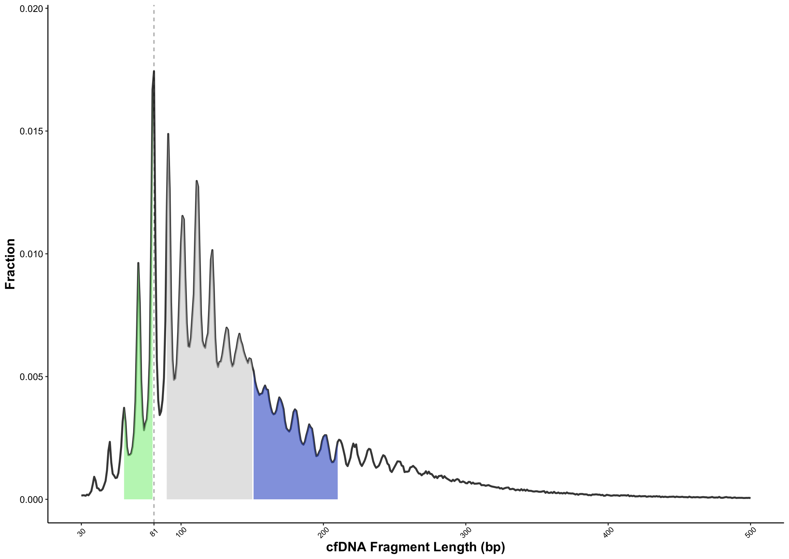
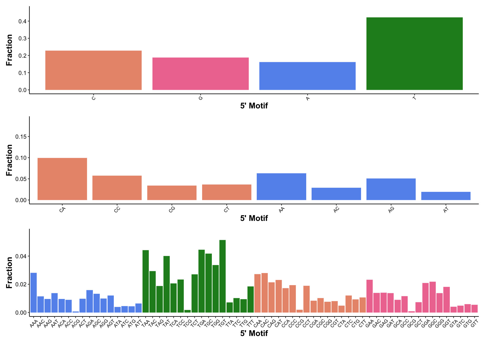
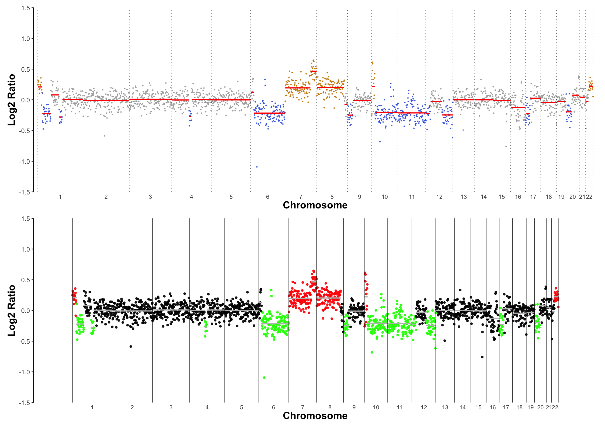

.. _cfdnapro_usage_tutorials:

*****************************************
Extracting and Visualising cfDNA Features
*****************************************

.. contents:: Table of Contents

--------------------------------------------------------------------------

Setup
=======================================================================================
In this tutorial,
we will process BAM files directly
and extract various cfDNA feature metrics,
instead of using .txt files.

We can install the latest version of
cfDNAPro to utilize all its newest features.
Please note that the development version may
include additional features, but they might
not be fully tested.

.. code:: R

    if (!require(devtools)) install.packages("devtools")
    library(devtools)

    devtools::install_github("hw538/cfDNAPro", force = TRUE)

For this tutorial we will also be using the ``patchwork``
R package.

.. code:: R

    devtools::install_github("thomasp85/patchwork")

    library(cfDNAPro)
    library(patchwork)

Read BAM File
=======================================================================================

The ``readBam()`` function can directly process
an indexed BAM file generated using Illumina
sequencing technology.

The function extracts paired-end sequencing information
applying the following default criteria:
(a) the reads are flagged as 'proper pair',
(b) the mapping quality score is at least 30,
and (c) the CIGAR string excludes any 'I'
(insertions) or 'D' (deletions).

.. code:: R

    bamfile <- "/path/to/bam_folder/test.bam"
    frag <- readBam(bamfile = bamfile)

Plot Fragment Size/Length
=====================================

.. code:: R

    # all functions that extract features begin with the prefix 'call'
    # we extract the fragment length/size using the 'callLength' function
    isize <- callLength(frag)

    # optional: area to highlight
    area_highlight <- list(list("fill" = "lightgrey", alpha = 0.6, "range" = c(90, 150)), 
                         list("fill" = "lightgreen", alpha = 0.6, "range" = c(60, 80)),
                         list("fill" = "royalblue3", "alpha" = 0.6, "range" = c(151, 210)))

    # all functions that plot features begin with the prefix 'plot'
    # we plot the fragment size/length using the 'plotLength' function
    p_isize <-  plotLength(isize, 
                         line_size = 1,
                         vline_size = 0.2,
                         vline_type = "dashed", 
                         vline_color =  "black", 
                         area_highlight = area_highlight)
    
    suppressWarnings(plot(p_isize))

|

Plot Fragment Motif
=====================================

.. code:: R

    # we set our motif as the first base on the 5' of the fragment
    p_motif_s1 <- callMotif(frag, motif_type = "s", motif_length = 1) %>%
    plotMotif(x_title = "5' Motif")

    # we set our motif as the first 2 bases on the 5' of the fragment
    p_motif_s2 <- callMotif(frag, motif_type = "s", motif_length = 2) %>%
    plotMotif(x_title = "5' Motif", motif_levels = c("C", "A"))

    # we set our motif as the first 3 bases on the 5' of the fragment
    p_motif_s3 <- callMotif(frag, motif_type = "s", motif_length = 3) %>%
    plotMotif(x_title = "5' Motif", motif_levels = c("A", "T", "C", "G"))

    # using patchwork, we aggregate all 3 plots together
    p_motif_s1/
    p_motif_s2/
    p_motif_s3

|

Plot Copy Number Profile
=====================================

.. code:: R

    cnv  <- callCNV(bamfile = bamfile)

    p_cnv1 <-  plotCNV(x = cnv, 
                    ylim = c(-1.5, 1.5), 
                    x_axis_expand = c(0.0075, 0.075),
                    y_axis_expand = c(0, 0),
                   segment_line_end = "butt")

    p_cnv2 <-  plotCNV(x = cnv, 
                    point_color = c("gain" = "red", "loss" = "green", "neutral" = "black"),
                    point_size = 1,
                    chr_edge_color = "black", 
                    chr_edge_type = "solid",
                    segment_color = "grey",
                    ylim = c(-1.5, 1.5), 
                    x_axis_expand = c(0.08, 0.08),
                    y_axis_expand = c(0, 0))

    p_cnv1 / p_cnv2

|
