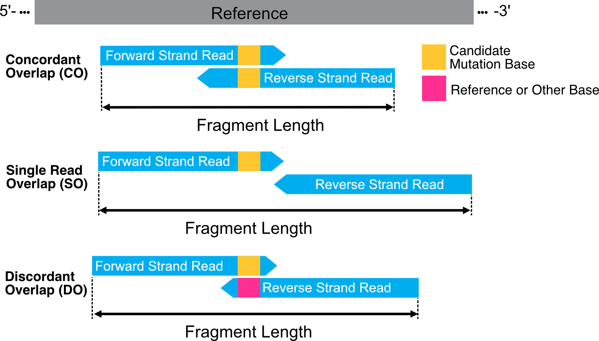
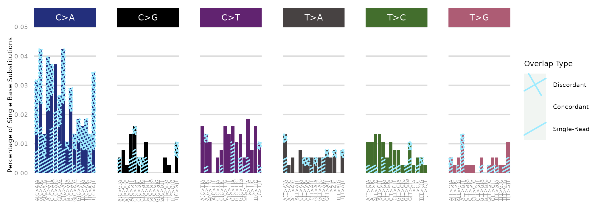
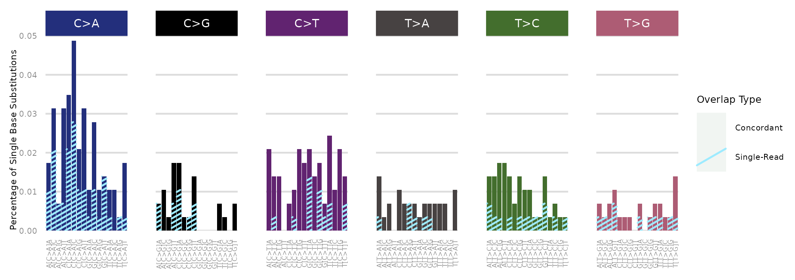

***********************************************
Mutational Feature Processing and Visualization
***********************************************

.. contents:: Table of Contents

------------------------------------------

Background
==================================
The terms "mutations" and "mismatches" are employed interchangeably in this context.
While an alteration in matched tumor tissue may be identified as a mutation
or a single-nucleotide variant (SNV),
the same alteration observed in the corresponding cfDNA sample
might not originate from biological processes.
Instead, it could result from library preparation or sequencing artifacts.
Consequently, such alterations are referred to as mismatches
or single base substitutions (SBS).

In the field of cfDNA analysis,
several strategies are employed to enhance the confidence
that a specific base change is a tumor-derived mutation.
A prevalent approach involves utilizing mutational information
from matched tumor tissue as a prior.
This method seeks to identify corresponding mutations in
the matched cfDNA sample. If a mutation is supported by a sufficient number
of unique (non-duplicate) cfDNA fragments,
it is likely to be a genuine mutation present in the cfDNA sample.
The probability that this mutation is tumor-derived is contingent upon
the quality of the initial tumor mutation list used as a prior.

However, if the cfDNA sample displays
only one fragment supporting the mutation
identified in tumor tissue, this could still
be an artifact arising from various stages of
sample processing and sequencing. To address this,
one effective denoising strategy involves the use
of error-suppression techniques.
An example of such a method is paired-end read overlap,
which we will explore in more detail below.

If a tumor-informed approach is not feasible—meaning
there is no available matched tumor tissue mutational data to use as
a prior—identifying tumor-derived cfDNA mutations necessitates alternative methods.
One approach requires a sufficiently high ctDNA tumor fraction,
where the fraction of tumor-derived cfDNA molecules relative to all cfDNA molecules
is significant enough that ≥2 cfDNA fragments support the mutation.
Additional evidence must also confirm that these are not germline mutations.
Alternatively, a pre-trained model can be used to differentiate ctDNA mutations
from other sources of noise, such as germline variants, sequencing artifacts,
and mutations due to clonal hematopoiesis. This model would leverage various
ctDNA features to accurately identify tumor-specific mutations.

Currently, our package supports the analysis of SBSs.
Moving forward, we aim to expand its capabilities
to include additional mutation types.

``cfDNAPro`` includes a novel feature that allows for the annotation of each
cfDNA fragment with detailed mutational information.

The package introduces an innovative functionality that allows for the annotation
of each cfDNA fragment with detailed mutational information.
This feature is versatile and can be employed for various applications
including the identification of tumor-specific mutations in cfDNA,
the refinement of mutation lists to reduce noise,
and the preparation of data structures essential for
training and developing deep learning/AI models.

Analyzing cfDNA Fragments with Mutational SNV Data
===================================================
In this tutorial,
we will demonstrate how to process BAM files to extract a range
of cfDNA feature metrics alongside mutational SNV information.

The mutational data can be
provided by including an additional ``mutations.tsv`` mutation file
and specifying it in the ``readBam()`` function using the
``mutation_file =`` parameter:

.. code:: R

  # Process cfDNA data with mutational information from a pre-existing file
  readBam(bamfile = "path/to/bamfile.bam",
          mutation_file = "/path/to/mutation_file.tsv")

The mutation file used in analyses can be sourced from
matched tumor tissue sequencing data or can include common cancer mutation hotspots.
It must be formatted in a tab-separated layout containing four columns: 
``chr pos ref alt`` in a tab-separated format.

Alternatively,
mismatches can be identified dynamically rather than relying on a predefined mutation list. 
We utilize the ``Rsamtools::pileup()`` function to generate a list of mismatches.
These are then processed in the same manner as entries from the mutation file:

.. code:: R

  # Process cfDNA data with mutational data from Rsamtools pileup generated list
  readBam(bamfile = "path/to/bamfile.bam",
          call_mutations = TRUE,
          pileup_params = list(max_depth = 250,
                               min_base_quality = 13))

``pileup_params`` allows you to set the values that
are forwarded to the ``PileupParam()`` function in Rsamtools.
This method is not optimal for identifying tumour-derived mutations
and may result in many false positives.
Additionally, it can be inefficient in terms of computational processing and
resources, as this module has not been extensively tested.
Currently, it identifies the total number of cores available on your local machine
and utilizes all but one of those cores to
process the reads from specified chromosomes in parallel.
We plan to introduce wrapper scripts for high-performance computing (HPC) systems in the near future.

An alternative approach would be to generate a mismatch list
using ``bcftools mpileup`` in ``bash`` and then provide
it as a .tsv file for the ``readBam()`` function.

Advantages of the readBam() Function
=====================================

The ``readBam()`` function will read, extract,
and process cfDNA fragment data,
combining it with the mismatch or SNV (i.e., mutational information) data.
Each fragment will be annotated if it overlaps a mutation locus,
indicating whether the fragment's base matches the ``REF`` or ``ALT`` base.

An additional advantage of this mutational
feature is that paired-end overlap information
is also considered. cfDNA fragments vary in size,
and in a typical 150bp paired-end sequencing run,
the paired reads will have different lengths of overlap.
The scenarios of overlap are illustrated below:

|

Sequencing errors occurring during the nucleotide
addition stage in the sequencing flowcell can be suppressed
by selecting mismatches/mutations that are
overlapped by both paired-end reads.

Therefore, the ``readBam()`` function not only
annotates each fragment with whether it overlaps a mutation
locus and whether it has the ``REF`` or ``ALT`` base,
but also includes paired-end overlap information.
This indicates whether both reads overlap the mutation locus
or only of the reads overlaps the mutationlocus
(SO - single-read overlap),
and whether the paired read bases agree
(CO - concordant read overlap) or disagree (DO - dicordant read overlap).

Mutation Output Files
========================================
The mismatch/mutational information will
be encoded within the ``GRanges`` object
along with other columns indicating
fragment ID, fragment length,
read pair orientation, status
of whether it overlaps a target mutation locus,
the paired-end read overlap type, and the base type.
The ``GRanges`` object can then be converted to and R dataframe
for further inspection based on your analysis. 

.. code:: R

    # Process the BAM File
    gr_obj <- readBam(bamfile = "path/to/bamfile.bam",
                      mutation_file = "/path/to/mutation_file.tsv")

    # Convert GRanges object to dataframe for further inspection
    gr_obj <- as.data.frame(gr_obj)

Additionally, each mutationally annotated ``GRanges`` object
can be exported as a mutation-oriented ``.tsv`` file:

.. code:: R

    # Process BAM File
    gr_obj <- readBam(bamfile = "path/to/bamfile.bam",
                      mutation_file = "/path/to/mutation_file.tsv")

    # Export a mutation-oriented .tsv table summarising fragment information per mutation locus
    writeMutTable(granges_object = gr_obj, output_file = "./table.tsv")

The mutation-oriented table will summarize
the number of fragments for each candidate mutation,
categorizing the fragments by their base type and read-pair overlap type.

Lastly, we can visualise the the 96 trinucleotide SBS profile of each sample,
by utilising the ``callTrinucleotide`` and ``plotTrinucleotide`` functions.
For each mutation locus, we will summarize the mutational information by
identifying the most prominent mutant base if multiple different bases are
present and by selecting the most prominent read overlap type.
If the mutation is supported by a discordant overlap fragment,
then we will use the base that supports the base from the mismatch/mutation list.

.. code:: R

    # Process cfDNA and Mutational Data
    gr_obj <- readBam(bamfile = "path/to/bamfile.bam",
                     mutation_file = "/path/to/mutation_file.tsv")

    # Generate a Dataframe with Trinucleotide SBS Information
    trinuc_obj <- callTrinucleotide(gr_obj)

    # Plot the Trinucleotide SBS Profile
    plotTrinucleotide(trinuc_obj)

|

The plot will discriminate between SBS supported by discordant-bases, and single-read/paired-read overlap.

Alernatively, we can plot the trinucleotide profile by excluding the discordant bases.

.. code:: R

    # Process cfDNA and Mutational Data
    gr_obj <- readBam(bamfile = "path/to/bamfile.bam",
                     mutation_file = "/path/to/mutation_file.tsv")

    # Generate a Dataframe with Trinucleotide SBS Information
    trinuc_obj <- callTrinucleotide(gr_obj)

    # Plot Trinucleotide SBS Profile by excluding the dicordant read-pair overlap SBSs
    plotTrinucleotide(trinuc_obj,
                      remove_type = c("DO"))

|
