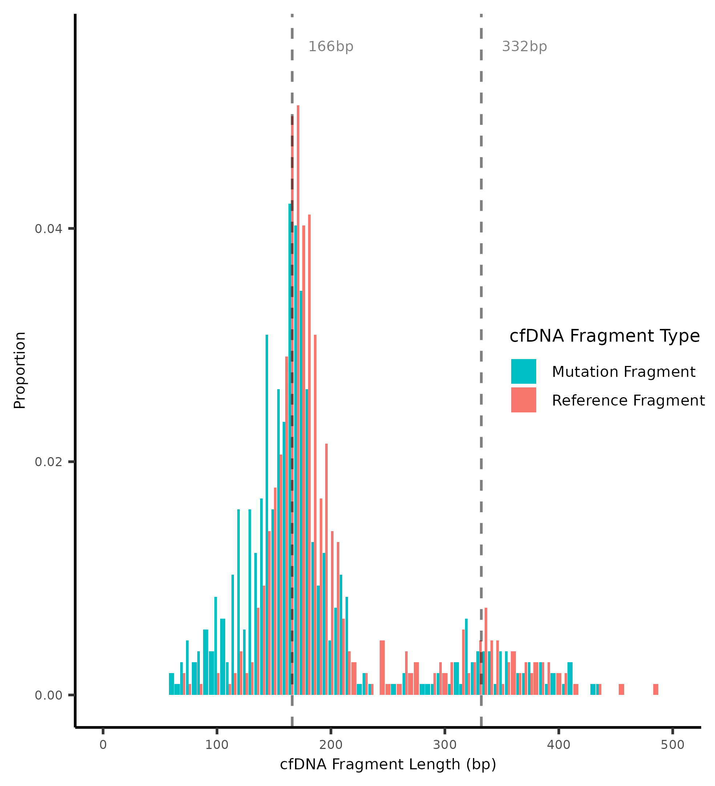
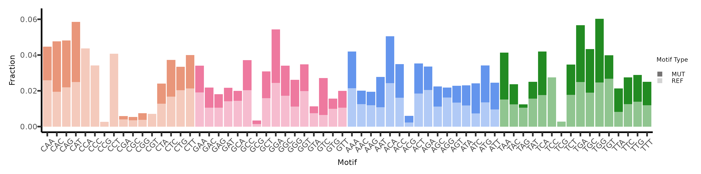
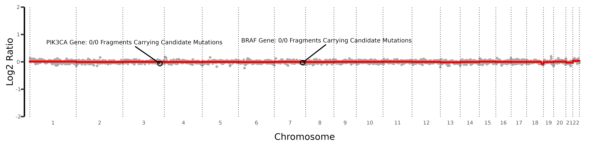

***********************************************
Multi-Feature Integration and Visualisation 
***********************************************

.. contents:: Table of Contents

------------------------------------------

Each type of cfDNA fragment plot (length, motif, and CNV)
can also incorporate mutational data.

This integration is feasible if the GRanges object was created through
the execution of ``readBam(mutation_file = /path/to/file.tsv)`` or
``readBam(call_mutations = TRUE)``.

The default behavior of the ``readBam()`` function is to process all DNA fragments
within the BAM file. However, by setting ``mut_fragments_only = TRUE``,
the function will only analyse fragments that overlap with the specified mutation loci.
This option reduces the computational load and may be adequate for users who do not
require information from non-overlapping fragments for fragment motif and fragment length analyses.

Below are the various ways to execute the ``readBam()`` function:

.. code:: R

  # Process all fragments present within the BAM file without mutational annotation
  readBam(bamfile = "path/to/bamfile.bam")

  # Process all fragments present within the BAM file with additional mutation annotation
  readBam(bamfile = "path/to/bamfile.bam",
          mutation_file = "/path/to/mutation_file.tsv")
  
  # Process fragments that overlap loci indicated in the mutation file
  readBam(bamfile = "path/to/bamfile.bam",
          mutation_file = "/path/to/mutation_file.tsv",
          mut_fragments_only = TRUE)
  
  # Process fragments that overlap loci generated during the pileup
  readBam(bamfile = "path/to/bamfile.bam",
          call_mutations = TRUE,
          mut_fragments_only = TRUE)
  

Fragment Length and Fragment Mutations
================================================

.. code:: R

  # Process all fragments present within the BAM file with additional mutation annotation
  frag_obj <- readBam(bamfile = "path/to/bamfile.bam",
                      mutation_file = "/path/to/mutation_file.tsv")

  # Call cfDNA fragment lengths
  length_obj <- callLength(frag_obj,
                           integrate_mut = TRUE,
                           ref_type = "locus_fragment",
                           downsample_ref = TRUE)

  # Plot normalised MUT and REF fragment lengths
  plotLength(length_obj,
             output_file = "/path/to/length_plot.png",
             ggsave_params = list())

The ``ref_type`` parameter enables users to specify
the type of reference fragments to
consider when plotting against fragments
associated with a particular mutation.

This parameter accepts two potential values:

``ref_type = "locus_fragment"``: This setting targets fragments that overlap with
a known mutation locus but match the reference base.
Such fragments typically originate
from non-cancerous cells, although it's possible for
non-mutant base fragments to come from cancer cells as well.

``ref_type = "outer_fragment"``: This option selects fragments that do not
overlap with any recognized mutation locus. These are generally presumed
to be non-mutant base fragments. However, there may be undetected mutations
not included in the ``.tsv`` file or missed during the pileup process.
Consequently, some outer fragments might overlap with these unknown mutations,
although this overlap remains undetermined due to the lack of
mutational annotation for those fragments. This option requires
that the user generates the initial GRanges object with ``mut_only = FALSE``
so that outer fragments are included.

The ``downsample_ref`` parameter enables users to adjust the number of reference
base fragments to match the count of mutant base fragments.
This downsampling ensures a balanced comparison between the two types of fragments in analyses.

Plots will be automatically saved if you specify a path and
filename using the ``output_file`` argument.
Additionally, users can customize the plot file using the ``ggsave_params`` parameter.

|

Fragment Motif and Fragment Mutations
================================================

The motifs can be plotter similarly.

.. code:: R

  # Process all fragments present within the BAM file with additional mutation annotation
  frag_obj <- readBam(bamfile = "path/to/bamfile.bam",
                      mutation_file = "/path/to/mutation_file.tsv")

  # Call cfDNA fragment motifs
  motif_obj <- callMotif(frag_obj,
                         integrate_mut = TRUE,
                         ref_type = "locus_fragment",
                         downsample_ref = TRUE)

  # Plot normalised MUT and REF fragment motifs
  plotMotif(motif_obj,
            output_file = "/path/to/motif_plot.png",
            ggsave_params = list())

|

Copy-Number and Fragment Mutations
================================================

You can also plot CNV with integrated mutational
information for each SNV within genes of interest.
This requires that the gene of interest includes SNVs
listed in the mutation file or those processed
during the pileup in the ``readBam()`` function.
The plot will then display total counts of all SNVs
within that gene, including both MUT and REF fragments, as an
additional annotation for the specified genes.

.. code:: R

  # First, call the cfDNA fragment length object
  cnv_obj <- callCNV(bamfile = "/path/to/bamfile.bam",
                     bin_size = 1000,
                     genome_label = "hg38")

  # Process fragments that overlap loci indicated in the mutation file
  frag_obj <- readBam(bamfile = "path/to/bamfile.bam",
                      mutation_file = "/path/to/mutation_file.tsv",
                      mut_fragments_only = TRUE) 

  # Plot normalised MUT and REF fragment lengths
  plotCNV(motif_obj,
          frag_obj_mut =  frag_obj
          output_file = "/path/to/cnv_plot.png",
          gene_to_highlight = list("ENTREZID" = NULL,
                                   "ENSEMBL" = NULL,
                                   "SYMBOL" = c("BRAF", "PIK3CA")),
          ggsave_params = list())

|
