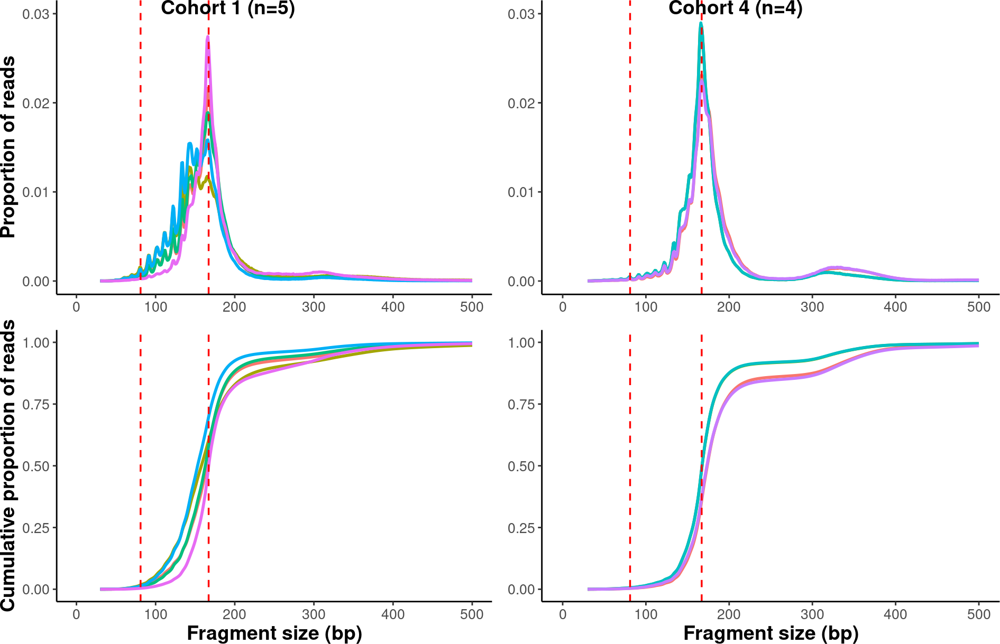
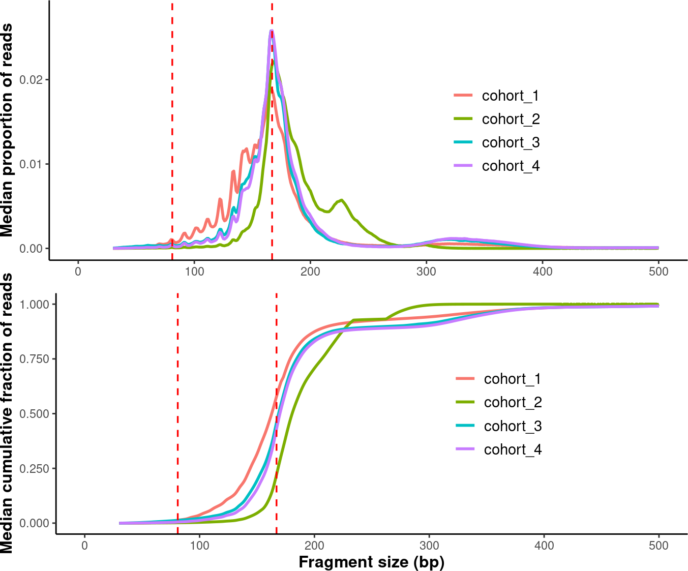
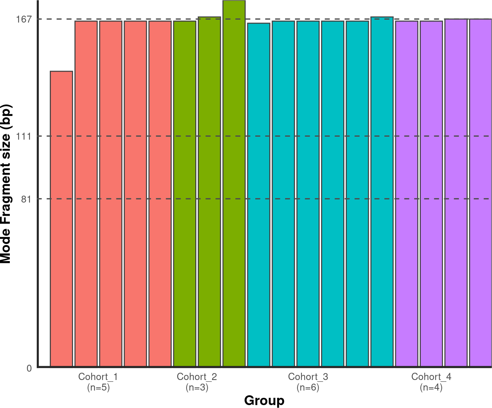
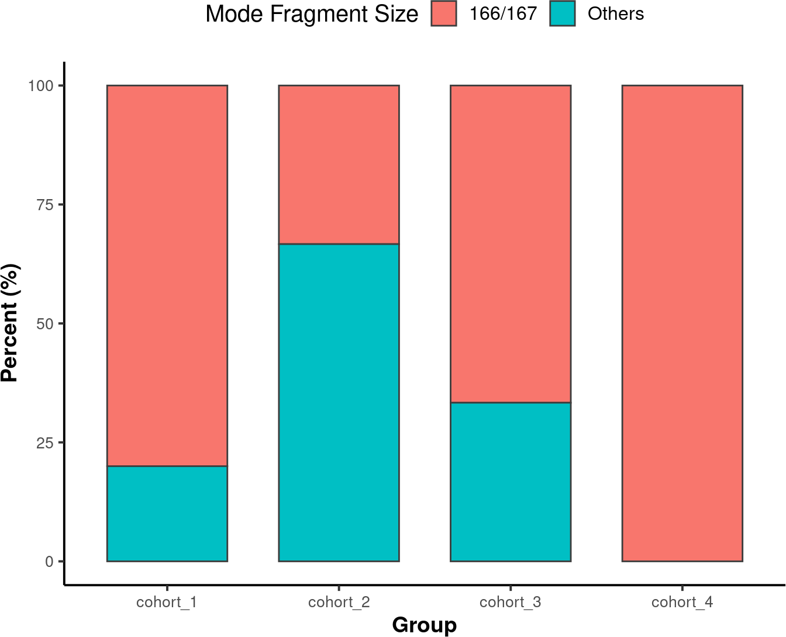
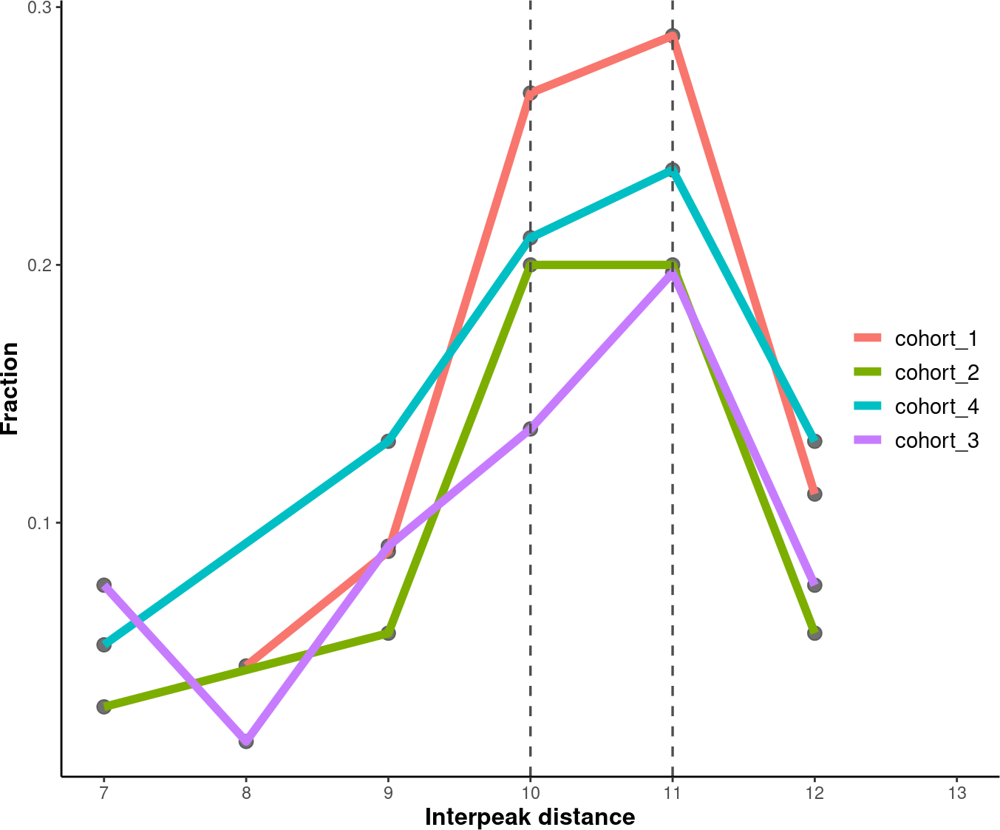
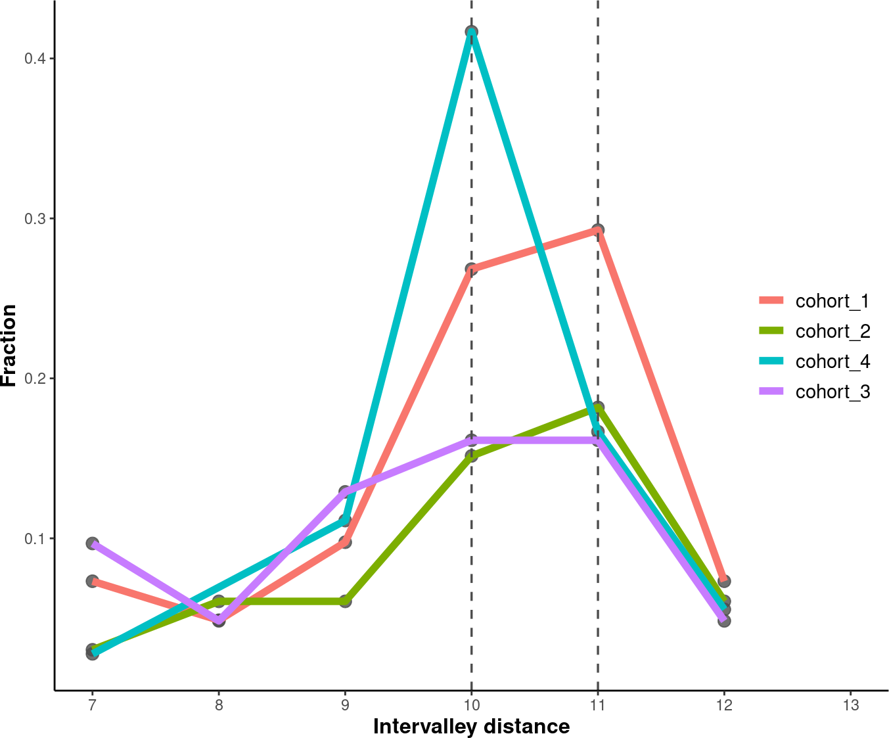
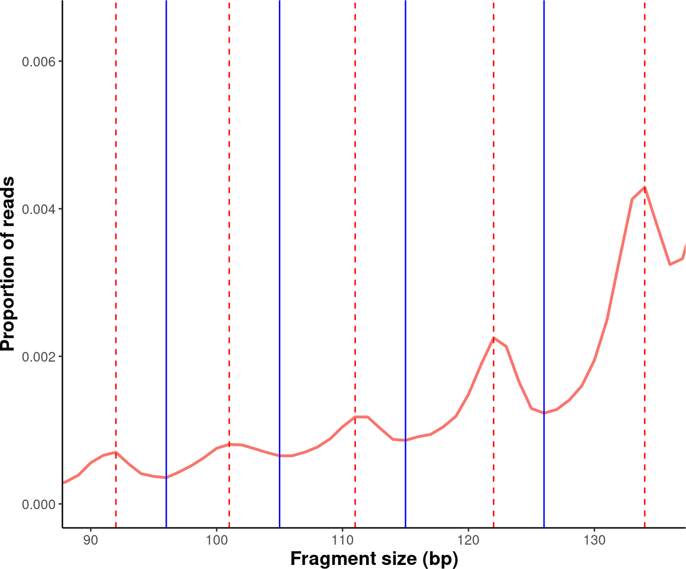
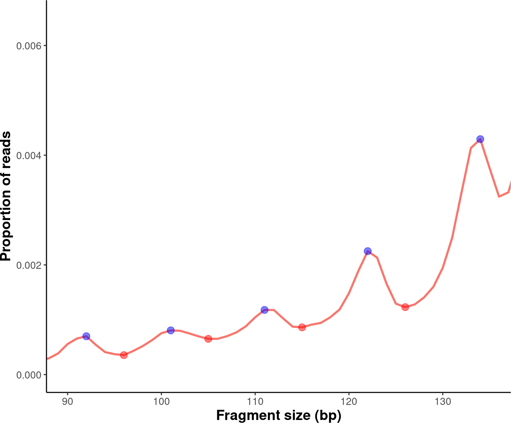

********************************************************
Additional Examples of using the cfDNAPro R Package
********************************************************

.. contents:: Table of Contents

--------------------------------------------------------------------------

Fragment Size Data
=======================================

In this tutorial, we will be working with fragment
size metrics data, which
are commonly generated in cfDNA research using
`Picard <https://samtools.github.io/hts-specs/SAMv1.pdf>`__.

    Picard is a set of command line tools for manipulating high-throughput sequencing (HTS) data and formats such as SAM/BAM/CRAM and VCF. These file formats are defined in the Hts-specs repository. See the SAM specification and the VCF specification. [1]_

Fragment size, also commonly referred to as cfDNA
fragment length,
can be directly extracted from BAM files using
``cfDNAPro``,
or alternatively, the package can read insert size
metric files
generated by the Picard tool.
This tutorial will specifically focus on
processing insert size metrics from .txt files,
which can be generated using the
`CollectInsertSizeMetrics <https://broadinstitute.github.io/picard/command-line-overview.html#CollectInsertSizeMetrics>`__
Picard function.

Processing .txt Files
=========================
To utilize the cfDNAPro package, organize all .txt files generated by Picard 
into sub-folders named according to each cohort even if there is only one cohort.
Example .txt files are included with the installation of this package.

Below are the steps to access the example data:

.. code:: R

    library(cfDNAPro)
    # Get the path to example data in the cfDNAPro package library path.
    data_path <- examplePath("groups_picard")

The example data is organized into four groups,
each stored in its own sub-folder named
``cohort_1``, ``cohort_2``, ``cohort_3``, and
``cohort_4``.
Each folder contains specific samples,
represented as .txt files.

To review the files within these directories,
use the list.files function with the following
parameters:
``list.files(data_path, full.names = TRUE, recursive = TRUE)``

Note: The cohorts labeled as ``cohort_1``, ``cohort_2``, ``cohort_3``,
and ``cohort_4`` are not associated with any biological
significance.
These are simulated datasets not linked to any specific
cancer types.
In the following sections, you will encounter several
plots
demonstrating biological cfDNA feature patterns.
Please note that these plots and data are intended
solely to illustrate
the functionality of cfDNAPro for data analysis and
visualization
purposes.

In your own analysis,
you can apply these functions to analyze cfDNA NGS
sequencing data
from cancer samples, helping you uncover fragmentation
features that
are relevant to your research questions.

Creating a Plot for an Individual Group/Cohort
==============================================

We have data from four groups and would like to
plot one specific cohort (e.g., ``cohort_1``).
This is how can we plot the three .txt files in
``cohort_1``:

.. code:: R

  cohort1_plot <- cfDNAPro::callSize(path = data_path) %>%
  dplyr::filter(group == as.character("cohort_1")) %>%
  cfDNAPro::plotSingleGroup()
  # setting default outfmt to df.
  # setting default input_type to picard.

In the cohort1_plot list (which is actually an R list),
you will find three ggplot2 objects: ``prop_plot``,
``cdf_plot``, and ``one_minus_cdf_plot``.
This allows you to modify these plots using ggplot2
syntax.

Custom Plots
==============================================

In this session, We will demonstrate how you can
manipulate ggplot2 objects and create multiple panels
in a figure. The explanation for calculating fragment size
metrics is detailed below:

**Upper Panels (Proportion Plot):**

x-axis: Fragment length (from 30bp, 31bp, …, 500bp),
represented as discrete integers.

x-axis Range:
We plot fragment lengths from 30bp to 500bp because
the proportion of fragments < 30bp is noisy and the
proportion of fragments > 500bp is usually too low
to be useful.
If users want to expand the x-axis,
parameters can be set in the ``callSizefunctions``.

y-axis: Proportion of reads with a specific read length.
Note: The line is not a smoothed curve;
it is a line connecting different data points.

**Lower Panels (Cumulative Plot):**

x-axis: Fragment length (from 30bp, 31bp, …, 500bp),
represented as discrete integers.

y-axis: Count the number of reads ≤ N bp (e.g., 30bp).
Normalize the count to a proportion.
Repeat steps 1 and 2 for each fragment size
(i.e., 30bp, 31bp, …, 500bp) count.
Note: This is not a smoothed curve;
it is a line connecting different data points.

.. code:: R

    library(scales)
    library(ggpubr)
    library(ggplot2)
    library(dplyr)

    # Define a list for the groups/cohorts.
    grp_list <- list("cohort_1" = "cohort_1",
                "cohort_2" = "cohort_2",
                "cohort_3" = "cohort_3",
                "cohort_4" = "cohort_4")

    # Generating the plots and store them in a list.
    result <- sapply(grp_list, function(x){
        result <- callSize(path = data_path) %>% 
            dplyr::filter(group == as.character(x)) %>% 
            plotSingleGroup()
        }, simplify = FALSE
    )
    # setting default outfmt to df.
    # setting default input_type to picard.
    # setting default outfmt to df.
    # setting default input_type to picard.
    # setting default outfmt to df.
    # setting default input_type to picard.
    # setting default outfmt to df.
    # setting default input_type to picard.

    # Multiplexing the plots in one figure
    suppressWarnings(
    multiplex <-
        ggarrange(result$cohort_1$prop_plot + 
                theme(axis.title.x = element_blank()),
                result$cohort_4$prop_plot + 
                theme(axis.title = element_blank()),
                result$cohort_1$cdf_plot,
                result$cohort_4$cdf_plot + 
                theme(axis.title.y = element_blank()),
                labels = c("Cohort 1 (n=5)", "Cohort 4 (n=4)"),
                label.x = 0.2,
                ncol = 2,
                nrow = 2))

    multiplex

  
|

Plotting Median Fragment Size
==============================================

In the last session,
we plotted all samples in each group.
Now, we will calculate the median fragment
size distribution for each group and then plot
these median distributions together.

.. code:: R

    # Set an order for those groups (i.e. the levels of factors).
    order <- c("cohort_1", "cohort_2", "cohort_3", "cohort_4")
    # Generate plots.
    compare_grps <- callMetrics(data_path) %>% plotMetrics(order=order)
    #  setting default input_type to picard.

    # Modify plots.
    p1 <- compare_grps$median_prop_plot +
    ylim(c(0, 0.028)) +
    theme(axis.title.x = element_blank(),
            axis.title.y = element_text(size = 12,face = "bold")) +
    theme(legend.position = c(0.7, 0.5),
            legend.text = element_text(size = 11),
            legend.title = element_blank())
    # Warning: A numeric `legend.position` argument in `theme()` was deprecated in ggplot2
    # 3.5.0.
    # ℹ Please use the `legend.position.inside` argument of `theme()` instead.
    # This warning is displayed once every 8 hours.
    # Call `lifecycle::last_lifecycle_warnings()` to see where this warning was
    # generated.

    p2 <- compare_grps$median_cdf_plot +
    scale_y_continuous(labels = scales::number_format(accuracy = 0.001)) +
    theme(axis.title = element_text(size = 12,face = "bold")) +
    theme(legend.position = c(0.7, 0.5),
            legend.text = element_text(size = 11),
            legend.title = element_blank())

    # Finalize plots.
    suppressWarnings(
    median_grps <- ggpubr::ggarrange(p1,
                        p2,
                        label.x = 0.3,
                        ncol = 1,
                        nrow = 2
                        ))

    median_grps

|

Plotting Modal Fragment Size
==============================================

Bar Chart
-----------------------------------------------
To calculate the modal fragment size for each
sample:

.. code:: R

    # Set an order for your groups, it will affect the group order along x axis!
    order <- c("cohort_1", "cohort_2", "cohort_3", "cohort_4")

    # Generate mode bin chart.
    mode_bin <- callMode(data_path) %>% plotMode(order = order, hline = c(167,111,81))
    # setting default mincount as 0.
    # setting default input_type to picard.

    # Show the plot.
    suppressWarnings(print(mode_bin))

|

Stacked Bar Chart
-----------------------------------------------
A Stacked Bar Chart is another way to visualize
the modal fragment size is with a stacked bar chart.

.. code:: R

    # Set an order for your groups, it will affect the group order along x axis.
    order <- c("cohort_1", "cohort_2", "cohort_3", "cohort_4")

    # Generate mode stacked bar chart. You could specify how to stratify the modes
    # using 'mode_partition' arguments. If other modes exist other than you 
    # specified, an 'other' group will be added to the plot.

    mode_stacked <- 
    callMode(data_path) %>% 
    plotModeSummary(order = order,
                    mode_partition = list(c(166,167)))
    # setting default input_type to picard.

    # Modify the plot using ggplot syntax.
    mode_stacked <- mode_stacked + theme(legend.position = "top")

    # Show the plot.
    suppressWarnings(print(mode_stacked))

|

Plotting Inter-peak/valley Distance
==============================================
To quantify the 10 bp periodical oscillations
observed in cell-free DNA fragmentation patterns,
we can calculate the inter-peak and inter-valley
distances and plot it.

Inter-Peak Distance
-----------------------------------------------

.. code:: R

    # Set an order for your groups, it will affect the group order.
    order <- c("cohort_1", "cohort_2", "cohort_4", "cohort_3")

    # Plot and modify inter-peak distances.

    inter_peak_dist <- callPeakDistance(path = data_path, limit = c(50, 135)) %>%
    plotPeakDistance(order = order) +
    labs(y = "Fraction") +
    theme(axis.title =  element_text(size = 12,face = "bold"),
            legend.title = element_blank(),
            legend.position = c(0.91, 0.5),
            legend.text = element_text(size = 11))
    # setting the mincount to 0.
    # setting the xlim to c(7,13). 
    # setting default outfmt to df.
    # setting default mincount to 0.
    # setting default input_type to picard.

    # Show the plot.
    suppressWarnings(print(inter_peak_dist))

|

Inter-Valley Distance
-----------------------------------------------

.. code:: R

    # Set an order for your groups, it will affect the group order.
    order <- c("cohort_1", "cohort_2", "cohort_4", "cohort_3")
    # Plot and modify inter-peak distances.
    inter_valley_dist<-callValleyDistance(path = data_path,  
                                        limit = c(50, 135)) %>%
    plotValleyDistance(order = order) +
    labs(y="Fraction") +
    theme(axis.title =  element_text(size=12,face="bold"),
            legend.title = element_blank(),
            legend.position = c(0.91, 0.5),
            legend.text = element_text(size = 11))
    # setting the mincount to 0. 
    # setting the xlim to c(7,13). 
    # setting default outfmt to df.
    # setting the mincount to 0.
    #u setting default input_type to picard.

    # Show the plot.
    suppressWarnings(print(inter_valley_dist))

|

Additional Plots
==============================================

Further modifications to the plots generated by
the cfDNAPro package can be done using ggplot2
syntax. For example, we can highlight the
peaks and valleys in the fragmentation patterns.

.. code:: R

    library(ggplot2)
    library(cfDNAPro)
    # Set the path to the example sample.
    exam_path <- examplePath("step6")
    # Calculate peaks and valleys.
    peaks <- callPeakDistance(path = exam_path) 
    #> setting default limit to c(35,135).
    #> setting default outfmt to df.
    #> Setting default mincount to 0.
    #> setting default input_type to picard.
    valleys <- callValleyDistance(path = exam_path) 
    # setting default limit to c(35,135).
    # setting default outfmt to df.
    # setting the mincount to 0.
    # setting default input_type to picard.
    # A line plot showing the fragmentation pattern of the example sample.
    exam_plot_all <- callSize(path = exam_path) %>% plotSingleGroup(vline = NULL)
    # setting default outfmt to df.
    # setting default input_type to picard.
    # Label peaks and valleys with dashed and solid lines.
    exam_plot_prop <- exam_plot_all$prop + 
    coord_cartesian(xlim = c(90,135), ylim = c(0,0.0065)) +
    geom_vline(xintercept = peaks$insert_size, colour = "red",linetype = "dashed") +
    geom_vline(xintercept = valleys$insert_size,colour = "blue")

    # Show the plot.
    suppressWarnings(print(exam_plot_prop))

|

We can label the peaks and valleys with dots:

.. code:: R

    # Label peaks and valleys with dots.
    exam_plot_prop_dot <- exam_plot_all$prop + 
    coord_cartesian(xlim = c(90,135),ylim = c(0,0.0065)) +
    geom_point(data= peaks, 
                mapping = aes(x= insert_size, y= prop),
                color="blue",alpha=0.5,size=3) +
    geom_point(data= valleys, 
                mapping = aes(x= insert_size, y= prop),
                color="red",alpha=0.5,size=3) 
    # Show the plot.
    suppressWarnings(print(exam_plot_prop_dot))

|

This is the end of the tutorial detailing
additional examples of how to use the ``cfDNAPro`` R Package.

Check out the following tutorials to become a true 
Pro at using the cfDNAPro package ``:)``

--------------------------------------------------------------------------

.. [1] Source: Official Picard website. URL: http://broadinstitute.github.io/picard/
